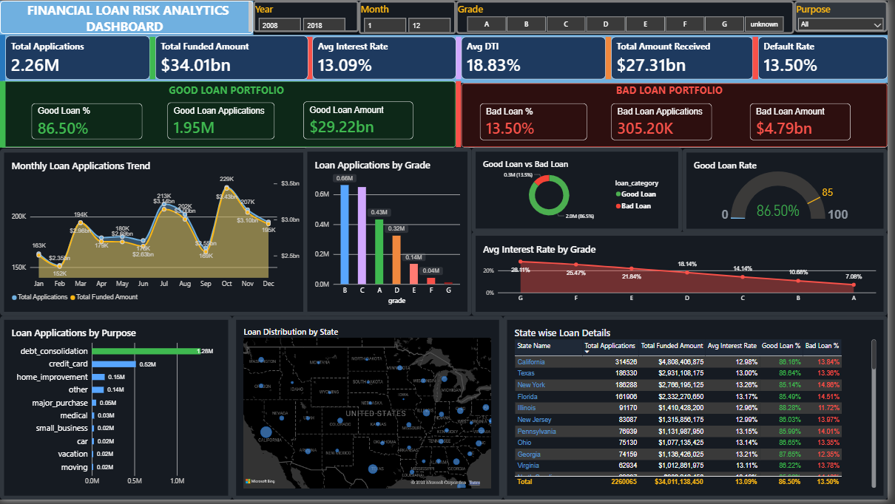
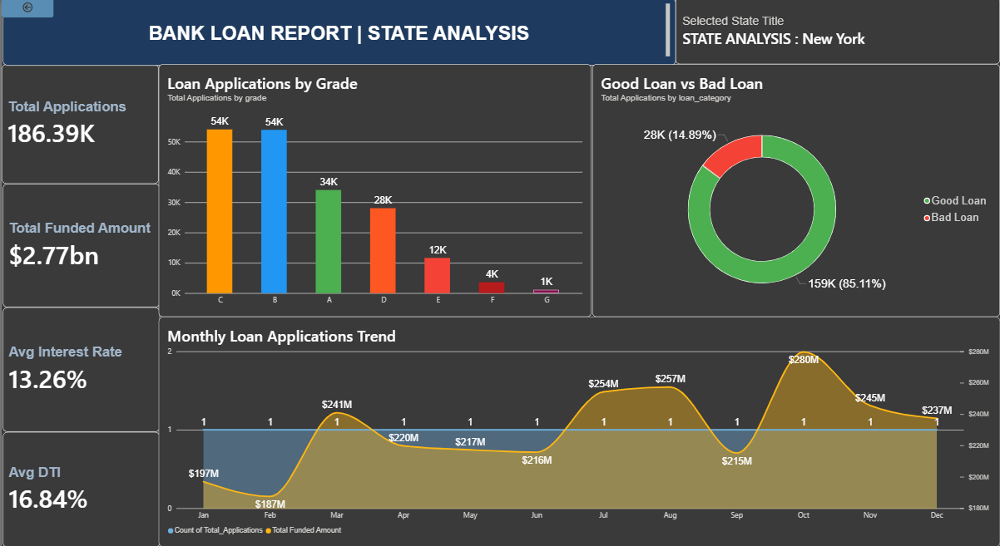

#  Financial Loan Risk Analytics Dashboard

> Analyzing 2.26 million real loan records to identify default risk patterns, borrower behavior, and geographic lending trends.

**Author:** Mohamed Arsath A | B.Tech AI & Data Science  
**Dataset:** Lending Club Loan Data — Kaggle (2007–2018)  
**Tools:** Python · Pandas · NumPy · MySQL · SQL · Power BI

---

## 📌 Business Problem

Loan defaults cost financial institutions **billions of dollars annually**. This project gives risk analysts data-driven insights to identify *why* loans default and *which borrowers are high risk* — before loans are issued.

---

## 📊 Dashboard Preview

### Overview Dashboard

### Drill-Through — State Analysis

---

## 📈 Key Business Metrics (KPIs)

| Metric | Value |
|--------|-------|
| Total Loan Applications | 2,260,701 |
| Total Funded Amount | $34.01 Billion |
| Total Amount Received | $27.31 Billion |
| Average Interest Rate | 13.09% |
| Average DTI | 18.82% |
| Good Loan Rate | 86.50% |
| Bad Loan Rate | 13.50% |
| Bad Loan Applications | 305,633 |

---

## 💡 Key Business Insights

1. **Portfolio is healthy** — 86.5% good loan rate across 2.26M applications
2. **Debt consolidation** is the #1 loan purpose (1.28M applications)
3. **Grade A loans** have the lowest default rate; Grade G has the highest interest rate (28.11%) and highest default risk
4. **December** consistently has peak loan applications
5. **California, Texas, New York** contribute the highest loan volumes
6. **High DTI borrowers** default significantly more than low DTI borrowers
7. **Renters default more** than homeowners across all loan grades

---

## 🛠️ Tools & Technologies

| Tool | Purpose |
|------|---------|
| Python (Pandas, NumPy) | Data cleaning & EDA |
| Matplotlib / Seaborn | Exploratory visualizations |
| MySQL | Data storage & advanced queries |
| SQL | Business logic & aggregations |
| Power BI | Interactive dashboard |

---

## 🔍 SQL Techniques Used

- Window Functions (`LAG`, `RANK`, Running Total)
- CTEs (Common Table Expressions)
- `CASE` statements for loan classification
- Subqueries for nested aggregations
- `GROUP BY` with `HAVING` for filtered summaries

---

## ⚡ Power BI Features Used

- KPI Cards with DAX Measures
- USA Bubble Map (geographic distribution)
- Drill-Through (state-level deep dive)
- Slicers (Year, Month, Grade, Purpose)
- Donut Chart, Bar Chart, Line + Area Chart
- Bookmarks for navigation

---

## ❓ Business Questions Answered

1. What is the overall loan default rate?
2. Which loan purpose has the highest default rate?
3. Does interest rate affect loan default?
4. Which employment length carries the lowest risk?
5. Which US states have the highest default concentration?
6. What is the relationship between annual income and default?
7. Which loan grade performs worst?
8. How has loan issuance grown month over month?

---

## 📁 Dataset

- **Source:** [Lending Club Loan Data — Kaggle](https://www.kaggle.com/)
- **Records:** 2.26 Million real loan applications
- **Period:** 2007 – 2018
- **Features:** 151 columns including loan amount, grade, purpose, DTI, interest rate, employment length, home ownership, and loan status

---

*Project by Mohamed Arsath A — B.Tech Artificial Intelligence & Data Science*
